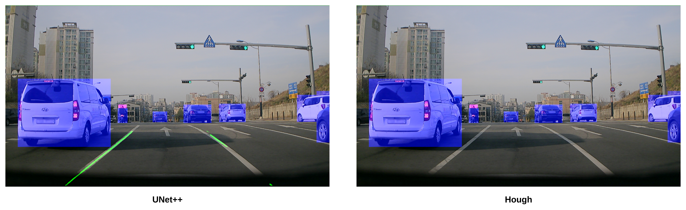
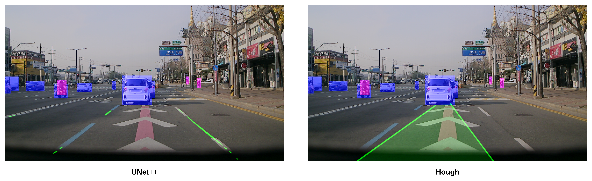
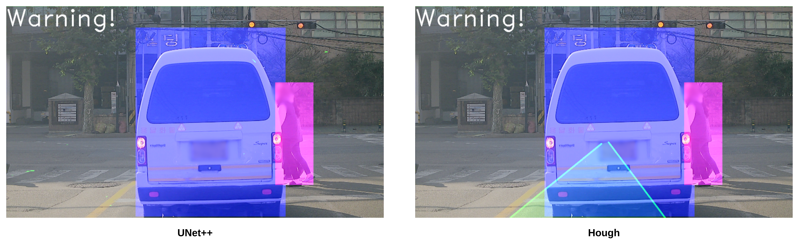

# ADAS 
ADAS (Advanced Driver Assistance System)을 일부 구현한 코드 <br>

보행자와 차를 인식하고, 차와 너무 전방에서 추돌할 위험이 있을 경우 경고를 메세지를 출력할 수 있는 기능을 구현하고<br>
도로의 lane을 detection 하여 visaulize 할 수 있도록 구현

<br>

Detection 모델을 학습하여 이미지에서 보행자와 자동차를 검출할 수 있도록 하였으며, 이를 바탕으로 전방 추돌의 위험이 있을 때, 경고 메세지를 출력하는 알고리즘 구현 <br>
Detection 모델을 YOLOv8을 이용하여 학습하여 사용하였으며 `yolo` 폴더에서 확인 가능 <br>
- 학습한 모델과 데이터는 [YOLO](https://github.com/YJH-jm/YOLO_Training)의 에서 똑같이 구현 가능


<br>

Lane을 찾기 위해 학습한 Segmentation 모델을 사용하거나, Hough 변환을 이용 <br>
Segmentation 모델은 unet++를 사용하였으며 `unetpp` 폴더에서 확인 가능 <br>
- [UNet++](https://github.com/YJH-jm/pytorch-nested-unet) 에서 필요한 코드만 가지고 와서 재구성
- 위의 링크에서 데이터 전처리 코드, 학습 코드 작성하여 학습

Hough 변환은  `hough` 폴더에서 확인 가능


<br>
<br>

## 설치
1. 가상 환경 설정
    ```
    conda create -n adas python=3.8
    conda activate adas
    ```
    <br>

2. Pytorch 설치
- cuda version에 맞는 torch, torchvision 설치

<br>

3. 필요 package 설치
    ```
    pip install pyyaml ultralytics opencv-python matplotlib
    ```

<br>

## 실행
`main.py` 파일은 다음과 같은 명령어로 실행

```
python main.py  --lane_model <unetpp or hough>
```

<br>
<br>

## 결과
결과를 시각화하여 테스트 확인하기 위해서 AI 허브의 [차량 및 사람 인지 영상](https://www.aihub.or.kr/aihubdata/data/view.do?currMenu=115&topMenu=100&aihubDataSe=data&dataSetSn=195) 샘플 데이터를 다운로드 받아 확인 <br>
이 데이터는 YOLO 학습에 이용이 되었으나, 학습에 이용되지 않은 데이터로만 확인 <br>
<br>
사람과 자동차의 경우 잘 찾지만 lane detection이 잘 되지 않았고 아래와 같이 시각화 된 결과로 확인<br>

<br>

<p align=center></p>

- UNet++는 lane을 잘 찾아내었지만, hough transform 을 이용한 방식으로는 찾지 못힘

<br>

<p align=center></p>

- UNet++와 hough 둘 다 결과가 나왔지만, hough가 정확한 lane을 detection 했다고 보기는 어려움

<br>

<p align=center></p>

- UNet++은 전방의 lane을 찾지 못함을 발생

<br>

<p align=center></p>

- 차량이 가까워지면 경고 문구 출력하는 것을 확인

<br>

Object Detection의 경우 사람이 아닌데 사람이라고 detection 하는 경우가 간혹 존재함 <br>
이 것을 제외하고는 테스트 데이터의 경우 좋은 성능을 보이는 것을 시각화 하여 확인<br>
<br>
Segmentation의 경우 hough transform을 이용한 경우는 lane을 찾지 못하는 경우가 많았고, 찾더라도 lane을 찾았는지 확신 할 수 없음<br>
UNet++의 경우는 전방의 lane을 상대적으로 잘 찾지만, 그렇다고 좋은 성능을 보이는 것 같지 않음<br>
또한 전방의 lane만 찾기 위해서 위의 방식처럼 ROI 적용하는 알고리즘 필요<br>
성능 향상을 위해 지금 사용한 UNet++ 모델보다 더 많은 데이터로 학습한, 성능이 더 좋은 모델 적용해야 함<br>
<br>
또한 전방 추돌이 발생할 것 같을 때, 경고를 주는 것도 옆 차선의 차나, 전방이 아닌 다른 곳의 사람을 제외하도록 수정이 필요<br>
